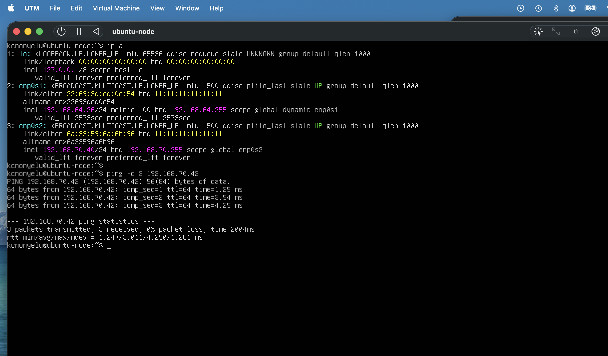
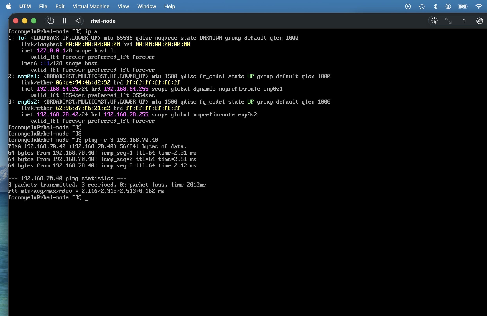
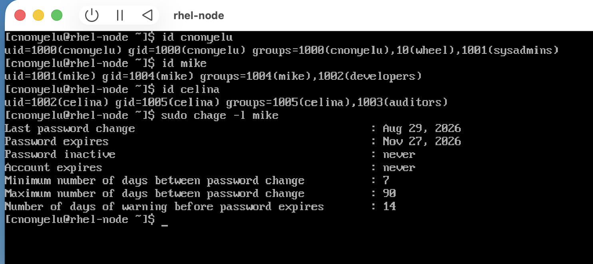
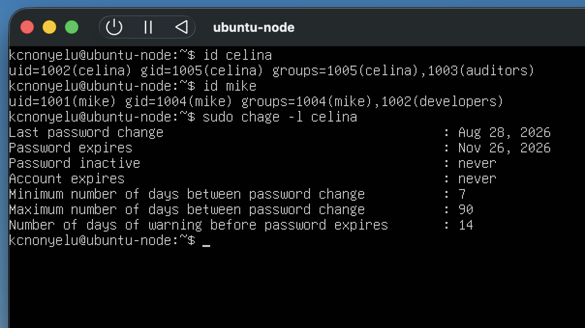
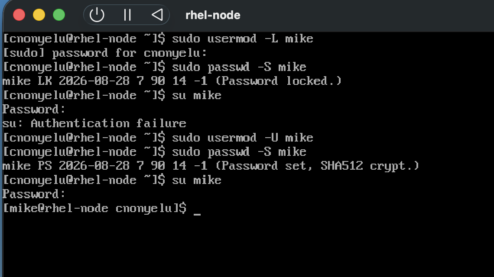
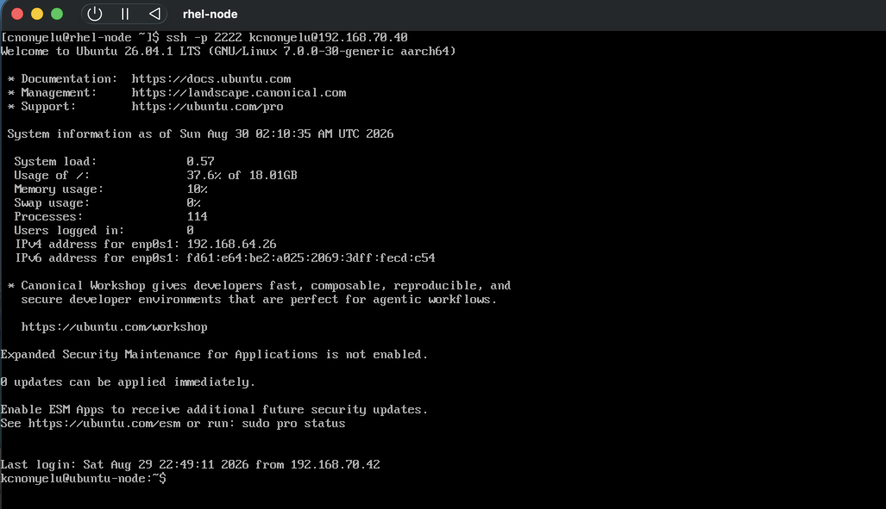
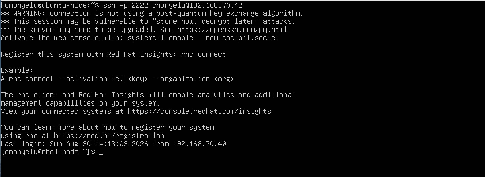
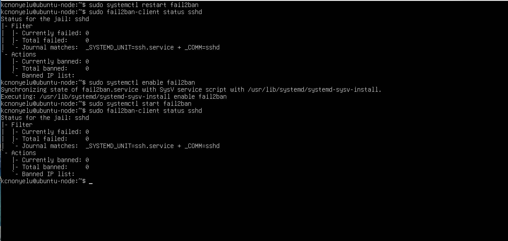

# Linux Systems Administration & Automation Lab

A hands-on, multi-node Linux lab built on UTM simulating enterprise server
operations across RHEL and Ubuntu environments. This lab covers user and group
management, SSH hardening, sudo policy enforcement, firewall configuration, systemd
service management, centralized logging, infrastructure monitoring, container
management, configuration management automation, and real-world troubleshooting.
It served as the primary preparation environment for the Red Hat Certified System
Administrator (RHCSA) exam, passed in February 2026.

---

## Lab Environment

| Component    | Node 1 — RHEL                                                                  | Node 2 — Ubuntu                                                                 |
|--------------|--------------------------------------------------------------------------------|---------------------------------------------------------------------------------|
| OS           | RHEL 9.8                                                                       | Ubuntu 26.04 LTS                                                                |
| Hostname     | rhel-node                                                                      | ubuntu-node                                                                     |
| Virtualization | UTM 4.7.4                                                      | UTM 4.7.4                                                         |
| Host OS      | mac OS                                                                      | mac OS                                                                      |
| Resources    | 2 vCPUs, 4 GB RAM, 40 GB                                                       | 2 vCPUs, 4 GB RAM, 40 GB                                                        |
| Primary Role | RHCSA practice, firewalld, systemd, SELinux, user mgmt, centralized log server | Bash automation, monitoring stack, Docker, Ansible control node, log forwarding |

---

## Network Architecture

Both VMs use an Host-Only for node-to-node communication with
static IPs. A separate NAT adapter provides internet access for package downloads.

| Adapter  | Type             | Purpose                        |
|----------|------------------|--------------------------------|
| enp0s2   | Host-Only        | Lab communication (192.168.70.x)|
| enp0s1   | Shared/NAT       | Internet access for downloads  |

Why I choose a dual Network configuration in UTM:

Host-only interface was chosen to isolate the lab environment from the physical network, creating a secure sandbox that prevents unintended traffic from escaping or entering my VMs.  Shared Network (NAT) Interface was chosen to provide a safe, oneway exit to the internet. It allows my VMs to download necessary updates and packages.

Lastly I avoided Bridged Network because if used, it would assign my VMs an IP address directly from whatever physical network I am connected to. Since I sometimes work on this project from public network like library or coffee shops, Bridged network could expose my VMs to other users on that public Wi-Fi network. At home, it could also lead to IP address conflicts.


---

## Table of Contents

1. [VM Setup](#1-vm-setup)
2. [User & Group Management](#2-user--group-management)
3. [SSH Hardening](#3-ssh-hardening)


---

## 1. VM Setup

### UTM Network Configuration

Both VMs are attached to the same Internal Network in UTM:

- VM1 (rhel-node): Host-Only `enp0s2`, static IP `192.168.70.42`
- VM2 (ubuntu-node): Host-Only `enp0s2`, static IP `192.168.70.40`

A second NAT adapter is added to each VM for internet access during package
installation. 

### RHEL Node Setup

Download RHEL 9 ISO via Red Hat's free Developer Program at
[developers.redhat.com](https://developers.redhat.com).

> **Version note:** Use the DVD ISO, not the Boot ISO. The DVD ISO is self-contained
> and does not require internet during installation. The Boot ISO requires network
> access to download packages mid-install which is unreliable in a lab environment.
> Use the aarch64 architecture version.

After installation, register and update:

```bash
sudo subscription-manager register --username <username> --auto-attach
sudo dnf update -y
sudo dnf install git curl wget net-tools tree firewalld -y
```

Set static IP and hostname:

```bash
sudo hostnamectl set-hostname rhel-node

# Run: ip a  to confirm your interface name before running nmcli
sudo nmcli con mod "enp0s2" ipv4.addresses 192.168.70.42/24 ipv4.method manual
sudo nmcli con up "enp0s2"
```

> **Interface naming note:** The interface name varies by VM configuration.
> Run `ip a` first to identify the correct name before running nmcli commands.
> In this lab the interface was `enp0s2`.

### Ubuntu Node Setup

Download Ubuntu 26.04 LTS Server ISO from [ubuntu.com](https://ubuntu.com/download/server).

> **Version note:** Ubuntu 26.04 LTS works identically to 24.04 for all lab
> commands. Use Server ISO not Desktop. Server has lower memory overhead and
> is more representative of enterprise Linux deployments.

After installation:

```bash
sudo apt update && sudo apt upgrade -y
sudo apt install git curl wget net-tools tree ufw fail2ban -y
sudo hostnamectl set-hostname ubuntu-node
```

Edit `/etc/netplan/01-netcfg.yaml`:

```yaml
network:
  version: 2
  ethernets:
    enp0s2:
      addresses: [192.168.70.40/24]
      nameservers:
        addresses: [8.8.8.8]
```

```bash
sudo netplan apply
```

### Verify Node Connectivity

```bash
# From rhel-node
ping -c 3 192.168.70.42

# From ubuntu-node
ping -c 3 192.168.70.40
```




---

## 2. User & Group Management

Performed on both nodes. RHEL and Ubuntu use identical `useradd`/`groupadd` syntax.

> **Important:** The primary user account (cnonyelu) & (kcnonyelu) is created during OS installation
> and already exists. Do not attempt to recreate it with useradd. Add it to groups
> using usermod instead. Only mike and celina need to be created fresh.

### Create Groups

```bash
sudo groupadd sysadmins
sudo groupadd developers
sudo groupadd auditors
```

### Create and Assign Users

```bash
# alice already exists from OS installation, add to sysadmins group only
sudo usermod -aG sysadmins cnonyelu

# bob and carol do not exist, create them normally
sudo useradd -m -s /bin/bash -G developers mike
sudo useradd -m -s /bin/bash -G auditors celina

sudo passwd mike
sudo passwd celina
```

> **RHEL note:** `useradd` on RHEL does not create a home directory by default
> unless `-m` is explicitly passed. Always include `-m` on RHEL.

### Set Password Aging Policies

```bash
sudo chage -M 90 -m 7 -W 14 cnonyelu
sudo chage -M 90 -m 7 -W 14 mike
sudo chage -M 90 -m 7 -W 14 celina
```

### Verify User Configuration

```bash
id cnonyelu
groups cnonyelu
sudo chage -l cnonyelu
```




### Lock and Unlock Accounts

```bash
sudo usermod -L mike
sudo passwd -S mike
sudo usermod -U mike
sudo passwd -S mike
```



---

## 3. SSH Hardening

SSH was hardened on both nodes with key-based authentication and a custom port.
Cross-node SSH was configured to simulate a real multi-server environment.

### Generate SSH Key Pair

```bash
ssh-keygen -t ed25519 -C "thelab-key"
```

### Copy Public Keys Between Nodes

```bash
# From rhel-node to ubuntu-node
ssh-copy-id -p 22 kcnonyelu@192.168.70.40

# Add ubuntu-node's public key to rhel-node authorized_keys manually
# On ubuntu-node:
cat ~/.ssh/id_ed25519.pub
# Copy output, then on rhel-node:
echo "paste-ubuntu-public-key-here" >> ~/.ssh/authorized_keys
```

> Add your host machine's public key to both nodes' authorized_keys
> to enable SSH tunnel access from the host.

### Harden SSH Configuration

```bash
sudo vim /etc/ssh/sshd_config
```

```
PermitRootLogin no
PasswordAuthentication no
MaxAuthTries 3
ClientAliveInterval 300
ClientAliveCountMax 0
Port 2222
AllowUsers cnonyelu
```

```bash
# RHEL
sudo systemctl restart sshd

# Ubuntu
sudo systemctl restart ssh
```

> **RHEL SELinux note:** Changing the SSH port requires updating SELinux port
> policy before the service will bind to the new port:

```bash
sudo semanage port -a -t ssh_port_t -p tcp 2222
sudo firewall-cmd --permanent --add-port=2222/tcp
sudo firewall-cmd --reload
```



>**Ubuntu ssh.socket conflict: Ubuntu runs `ssh.socket` by default,
which overrides the main configuration file and forces the system back to port 22.
To aviod this conflict and make the system use our port 2222, we can
completely turn off the socket system and activate traditional persistent service:

```bash
# Stop and disable conflicting services on Ubuntu
sudo systemctl stop ssh.socket
sudo systemctl disable ssh.socket
sudo systemctl restart ssh

```



### Configure fail2ban on Ubuntu Node

```bash
sudo vim /etc/fail2ban/jail.local
```

```ini
[sshd]
enabled = true
port = 2222
maxretry = 3
bantime = 3600
findtime = 600
logpath = /var/log/auth.log
```

```bash
sudo systemctl enable fail2ban
sudo systemctl start fail2ban
sudo fail2ban-client status sshd
```



---
